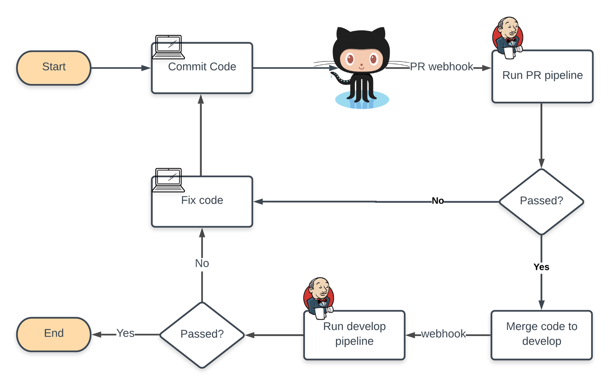

# CICD pipelines with Jenkins and webhooks
## Overview of the CI/CD process

## Pipeline Details

### Repository structure
The files in the repository are separated into 2 categories
1. Application source code: Files that are used by the build process to create the application image
2. Supporting files: Including   
   - App configurations: configurations that are specific to environment where the app is deployed(dev, test, prod, etc.). The app configuration files are mapped to Openshift configMaps and provided to the app deployment as volumes at runtime.
  
      ```
        infra/configs/app/
        ├── appConfig.cert.json
        ├── appConfig.dev.json
        ├── appConfig.local.json
        └── appConfig.test.json

        0 directories, 4 files
      ```
   - Infrastructure code: Jinja2 templates to build Openshift resources   
         
      ```
        infra/templates/
        ├── nginx
        │   └── nginx.conf.j2
        └── openshift
            └── reactjs-portal-resources.yaml.j2

        2 directories, 2 files
      ``` 
   - Other supporting files that are not used by the build process on Jenkins, e.g. local server configs, ide files, etc.   
   Supporting files which should be ignored by the build process need to be added to the file `.appbuildignore`:
   ```
    # a simple ignore file that uses exact matching. More complex formats (regex, glob, etc.) can be used later
    # require exact match for directories/files, also directories must be followed by /
    infra/
    README.md
    Jenkinsfile
    .appbuildignore
   ```
### Pipeline details
   The pipeline include 2 main stages: Build stage and deployment stage. 
   - The build stage is run when there is application code change. The final product of this stage is the app image that can be deployed to Openshift. If there is no application code change, or if the pipeline is run for the environment that is higher than dev, this stage is skip
   - The deployment stage creates a new rollout of the latest image (if the build stage was run) and any configuration changes (Openshift resources, application configs, etc.). Based on the environment, the deployment stage can include the promotion of the image from the lower environment.
### Ansible agent
  The ansible agent is used as part of the pipeline and takes advantage of Jinja2 templates to build Openshift resource files (yaml format). The same template can be used across environments with env specific data are added to it when the pipeline runs.   
  The ansible agent can also talk to Vault server and retrieve secrets that will be provided to Jinja2 templates. The `hashi_vault` lookup plugin is used for this purpose :
  
  `all.yml`
  ```
  ...
  hos_route_configs: "{{ lookup('hashi_vault', 'secret=vistracks/data/hos.{{OPENSHIFT_ENV}}.omnitracsone.com_routes:data auth_method=approle role_id={{role_id}} secret_id={{secret_id}} url={{ vault_url }} namespace=VisTracks validate_certs=no')}}"
  ...

  ```
  The current setup for Vault authentication uses the `approle` method and the `role_id` and `secret_id` retrieved from Jenkins credentials store (using [openshift-jenkins-sync-plugin](https://github.com/openshift/jenkins-sync-plugin#openshift-jenkins-sync-plugin) to convert Openshift secrets into Jenkins credentials).  
# Set up github webhooks for Jenkins main and PR build pipelines

## Webhook for main pipeline
1. Install [github plugin](https://plugins.jenkins.io/github/)   
2. Get the webhook url   
The default url is `{JENKINS_BASE_URL}/github-webhook/` In case we do not remember the URL or if we have a customized one, go to `Manage Jenkins > Configure System >GitHub` and click on the question mark to retrieve it.   

The webhook URL from the Jenkins configs is limited to the one set by Openshift which requires access to the API server. If the server stays behind a firewall then there is no way for github to send webhook event to. In order for this to work, we may need to use Jenkins webhook instead and make sure Jenkins is accessible publicly. Once configured to trigger the webhook should have url `{JENINS_BASE_URL}/github-webhook/`

3. Enable GitHub hook trigger   
Go to the build job. Select Build Triggers tab, and check on the box `GitHub hook trigger for GITScm polling`

4. Add the webhook URL to Github Go to GitHub repo and select `Settings > Webhooks > Add Webhook`:   

   - Paste the Jenkins webhook URL into the Payload URL box. 

   - Let Secret  field empty.

   - Select application/x-www-form-urlencoded for Content type.

   - Select Just the push event for Which events would you like to trigger this webhook?. 

   - Also if the Jenkins server uses a self-signed certificate, make sure we check Disable for SSL verification.
   - After adding the webhook URL, GitHub will send a test request to the server. Make sure the hook is shown with a green tick

## Webhook for PR pipeline
1. Install [GitHub Pull Request Builder plugin](https://plugins.jenkins.io/ghprb/)

2. Configure the plugin   
Go to `Manage Jenkins > Configure System >GitHub Pull Request Builder` add the GitHub credentials. Leave other blank
Note: Credentials need to have write access to the repository to send build status to the PR on GitHub

3. Configure build job for PR trigger

   - Add the project URL in 2 places:the GitHub project from the general tab, and Repositories on the Source Code Management tab. Note that the former requires the https url without .git at the end, e.g https://github.com/Omnitracs/test-webhook. `Note**: This seems to work only with https and not with ssh`. 
   - Connect to preview .

   - Click Advance and set Name as origin and Refspec as `+refs/pull/*:refs/remotes/origin/pr/*`

   - Set Branches to build as `${sha1}` or `${ghprbActualCommit}`

   - Check Use github hooks for build triggering. Also click on the question mark next to the option will show the GitHub webhook URL. By default this should be `{JENKINS_BASE_URL}/ghprbhook/`

   - We DO NOT need to select the option `GitHub hook trigger for GITScm polling` as the webhook is handled by the Pull Request plugin.

4. Add the webhook URL to Github Go to GitHub repo and select `Settings > Webhooks > Add Webhook`. 

   - Paste the Jenkins webhook URL into the Payload URL box. 

   - Let Secret  field empty.

   - Select application/x-www-form-urlencoded for Content type.

   - For `Which events would you like to trigger this webhook`? select Let me select individual events and then only choose Pull requests option.

   - Also if the Jenkins server uses a self-signed certificate, make sure we check Disable for SSL verification.
   - After adding the webhook URL, GitHub will send a test request to the server. Make sure the hook is shown with a green tick

# References
- [GitHub Pull Request Builder Plugin](https://github.com/jenkinsci/ghprb-plugin)